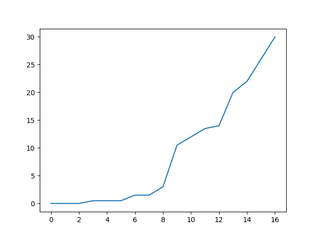
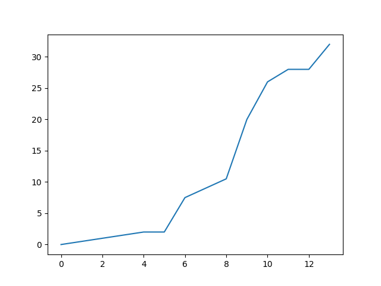

# Lista 2

### Dane znajdują się w [data.md](./data.md) lub w pliku [csv](./table.csv).

Wykresy przedstawiają odchylenie policzone algorytmem podanym poniżej od miejsca roweru w uporządkowanej tablicy, np. na pierwszym wykresie wiedzimy, że połowa rowerów miała niewielkie odchylenie wpisanego kodu od prawdziwego - lekko przekręcony zamek na jednym, dwóch miejscach, badź też wcale.

Algorytm liczący różnicę:
```
a <- kod właściwy
b <- kod na kłódce
changed = 0 // ilość różnic

for i in range (0, 4):
	x = a[i]
	y = b[i]
	res = min((x, y) mod 10, (y, x) mod 10)
	if res != 0.0:
	    changed = changed + 1
	sum = sum + res

// Dla znormalizowania wyników.
changed = changed / 2
sum = sum * changed
```

Jak widać algorytm uważa jeden zamek przekręcony kilka razy za mniesze odchylenie niż kilka zamków przekręconych raz, np. dla `1230` i `1234` da wynik mniejszy niż dla `1234` i `2345`.

Dla zamka elektronicznego: 


Dla zamka fizycznego: 


Jak widać, różnica nie jest duża, wynika to z tego, że rowery w zamkach elektronicznych też były kiedyś przypinane kłódką.